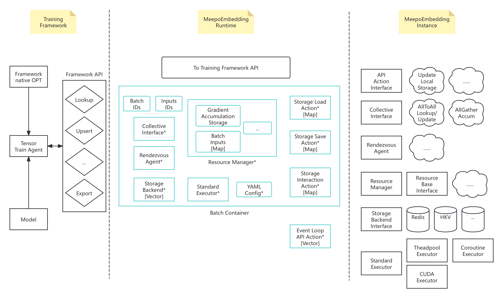

## 背景
分布式 large embedding 系统的现状是 TFRA/SOK只支持tensorflow，而pytorch 的开源推荐系统torchrec 
没有对dyanmic embedding, GPU embedding 和 同步训练的支持。TFRA采用horovod进行同步训练，
horovod的 ring all2all 实现合适dense tensor东部，但对于sparse tensor的embedding 同步，需要
查询和传输两步，这两步无法流水并行。

## 设计目标
解决超大规模embedding的训练和推理的核心问题，包括：
- 支持查询和传输同步进行 ring all2all embedding
- 支持多框架: Tensorflow, Pytorch 等
- 方便支持多种kv 后端: hkv, redis等
- 支持梯度累积

## 模块大图

## 模块详细设计

- 训练框架接口层 (python)
  - Tensor Train Agent, 用于适配训练框架的前向lookup API和后向优化器的梯度update,类似TFRA的shadow
    这个设计好处是复用原生优化器。不用为每个框架都写优化器。Tensor Agent接收优化器的梯度，然后调用Framework API进行update.
    有待研究的详细设计问题：TF的RegisterGradient能否对lookup 的op 注册，从而获得gradient以避免将gradient copy到shadow的这个中间步骤
  - Framework API, 提供后端 c++ API 的python封装, 包括 lookup, upsert, export, import等
- Step Container, 系统中控模块，管理batch和minibatch的训练(forward lookup 和 backward update)
  - Inputs ids: 每个batch/minibatch的输入ids, 因为shadow只有index，梯度update和累积的时候需要根据 ids里对应index的key进行update.
  - 系统其他模块的指针, 包括 Resource Manager, Collective communication, Rendezvous, Storage backend, Execution pool等
- 系统核心组件
  - Resource Manager, 接收框架优化器的update, 做minibatch 的 梯度累积,
    - 梯度累积的Storage
    - Batch inputs map, 就是 shadow ids和对应的 embedding table 的mapping
  - Collective communication component 负责 ring all2all for sparse和all gether for dense 两种集合通信
  - Rendezvous component 负责start the distributed service to manage gpu and manage each gpu’s embedding 分片
  - Storage backend component supports HKV, Redis, and rocksdb/flash, similar to Nvidia HPS，支持 load，save 和多级cache
  - Execution pool component, use Nivia’s Standard Executor to unify the execution of coroutine, thread pool and cuda multi-stream. 
  - 异步执行Event loop Actions
    - Storage load and save 
    - cache更新, 用于推理, 当backend storage 更新完成，生成一个更新的bloomfilter，然后更新本机的GPU和CPU cache
  - YAML config 比如对GPU内存，节点等配置

