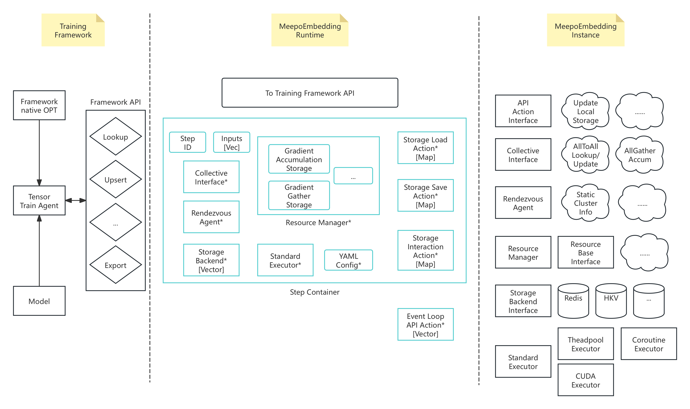

## Background
The current state of distributed large embedding systems is that TFRA/SOK only supports TensorFlow, while the open-source recommendation system for PyTorch, TorchRec, lacks support for dynamic embeddings, GPU embeddings, and synchronous training. TFRA uses horovod for synchronous training, where horovod's ring all2all is suitable for dense tensors but not for sparse tensor embeddings synchronization, which requires two steps: lookup and transfer. These steps cannot be parallelized in a pipeline.

## Design Goals
Address the core issues of training and inference for large-scale embeddings, including:
- Support for synchronous execution of lookup and transfer using ring all2all embedding.
- Multi-framework support: TensorFlow, PyTorch, etc.
- Easy support for various key-value (KV) backends: HKV, Redis, etc.
- Support for gradient accumulation.

## Module Overview

## Detailed Module Design

- Training Framework Interface Layer (Python)
    - Tensor Train Agent, which adapts the training framework's forward lookup API and the backward optimizer's gradient update, similar to TFRA's shadow. This design reuses the native optimizer. There is no need to write a specific optimizer for each framework. The Tensor Agent receives gradients from the optimizer, then calls the Framework API to perform updates.
        - Research question for detailed design: Whether TensorFlow's RegisterGradient could be used to register for the lookup operation, thereby obtaining the gradient and avoiding the intermediate step of copying the gradient to the shadow.
    - Framework API, providing a Python wrapper for backend C++ APIs, including lookup, upsert, export, import, etc.
- Step Container, the system control module, manages training batches and minibatches (forward lookup and backward update)
    - Input ids: IDs for each batch/minibatch input, necessary because the shadow only indexes, and gradients are updated and accumulated based on the corresponding index keys in the ids.
    - Pointers to other system modules, including Resource Manager, Collective Communication, Rendezvous, Storage Backend, Execution Pool, etc.
- Core System Components
    - Resource Manager, receives updates from the framework optimizer, manages minibatch gradient accumulation,
        - Storage for gradient accumulation
        - Batch inputs map, mapping shadow ids to the corresponding embedding table
    - Collective Communication Component responsible for ring all2all for sparse and all-gather for dense collective communications
    - Rendezvous Component responsible for starting the distributed service to manage GPU and manage each GPU’s embedding slice
    - Storage Backend Component supports HKV, Redis, and rocksdb/flash, similar to Nvidia HPS, supporting load, save, and multi-level caching
    - Execution Pool Component, uses Nvidia’s Standard Executor to unify the execution of coroutine, thread pool, and CUDA multi-stream.
    - Asynchronous Event Loop Actions
        - Storage load and save
        - Cache updates, for inference, updating the local GPU and CPU cache with a new bloom filter once the backend storage update is complete
    - YAML config for settings like GPU memory, node configurations, etc.